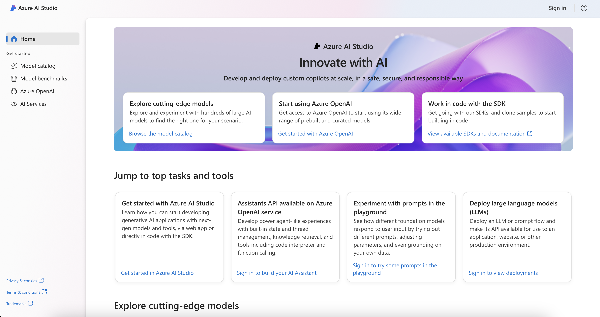
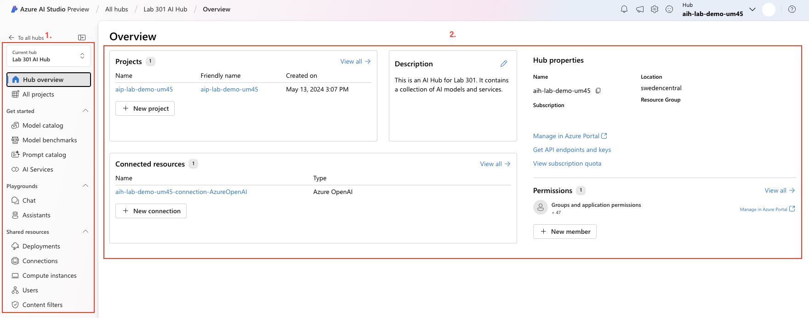
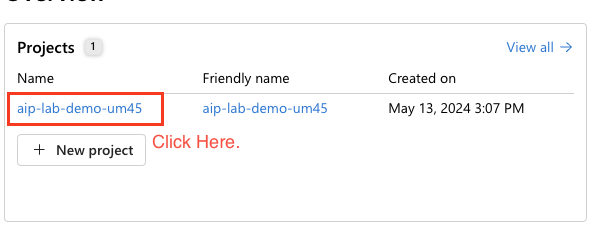
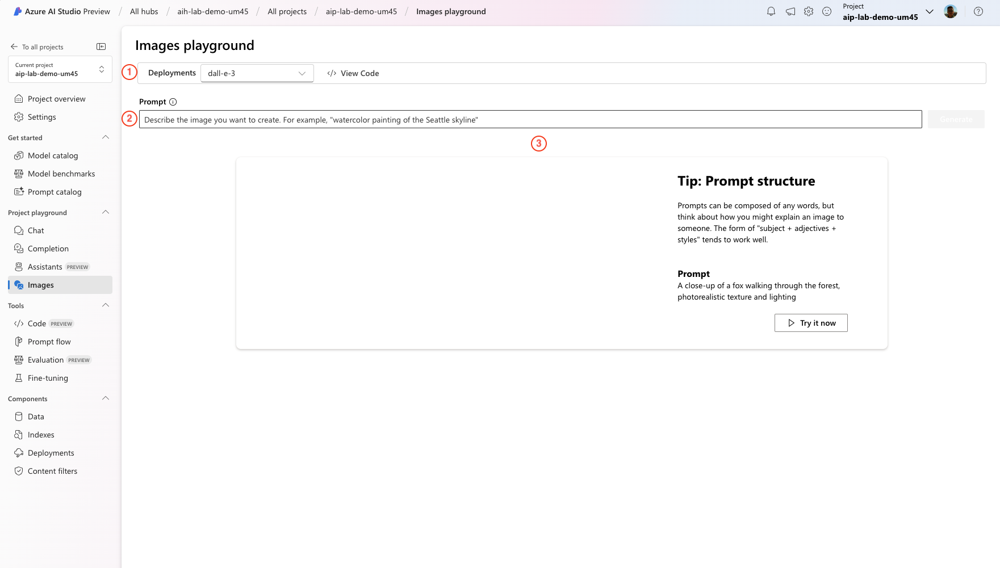

# 开始学习

> [!TIP]
> 什么是 **Azure AI Studio**？ Azure AI Studio 专为开发人员在企业级平台上构建生成式 AI 应用程序而设计。开发人员可以通过 Azure AI SDK 以代码优先的方式与他们的项目进行交互，使用最好的工具探索、构建、测试和部署 AI 模型，并在安全的环境中进行协同。该平台支持将 POC转化为实际生产的解决方案，并进行持续监控和改进。

首先，使用以下方式登录动手实验的 VM：
- Username: 已设置为 Admin。
- Password: 输入 +++@lab.VirtualMachine(Win11Base23B-W11-22H2).Password+++ 并单击。

> [!TIP]
> 第一次使用 **Skillable?** 绿色“T”（例如 +++Admin+++）表示只需单击一下即可在 VM 中的当前光标位置自动为您输入的值。这减少了您的工作量并最大限度地减少了输入错误。
   
在本次动手实验上，我们将研究 Azure AI Studio，特别关注 playground功能。我们可以通过打开 Edge 浏览器并访问 ++ +https://ai.azure.com+++ 来访问 Azure AI Studio。

## 进入 Azure AI Studio

让我们首先点击**Sign In**，您可以在窗口右上角找到登录链接，然后输入以下内容：

-  User: +++@lab.CloudPortalCredential(User1).Username+++
-  Password: +++@lab.CloudPortalCredential(User1).Password+++

现在我们已经登录，可以开始使用平台了。

1. 首先，点击左侧导航面板上管理下的**All Hubs**。
2. 然后，点击**Lab 301  AI Hub**。

## Hub 主页

一旦我们登录并进入 Hub 主页，您就会注意到相关项目。

### 1. 导航面板

在屏幕左侧，您将看到一个导航面板，其中包含一组不同的选项卡。

- **当前中心、中心概览和所有项目**：此选项卡提供对中心概览的访问，以及中心内所有项目的列表。
- **开始**：
  - *模型目录*：模型目录展示了 Azure AI Studio 中可用的模型。您可以单击并展开每个模型，以深入了解使用情况和其他详细信息。
  - *模型基准*：在这里，您可以比较可用模型和数据集之间的基准，并查看准确性、相似性、流畅性、连贯性等图表。
  - *提示目录*：提示目录为大量常见用例提供了示例提示，可用于进一步了解模型的工作原理，并可针对特定场景进行自定义。
  - *AI 服务*：在 AI 服务选项卡中，您可以看到可用的 Azure AI 服务列表，以及演示、用例等。

> [!NOTE]
> Azure AI Studio 托管了 Microsoft、Open AI、Hugging Face、Meta 和 Mistral 等公司提供的一些最受欢迎的基础模型。

- **Playgrounds**：Playgrounds 代表了一种与模型交互的快速且可访问的方式。
  
- **共享资源**：此选项卡提供对 AI Hub 连接或共享的资源的访问。在这里，您可以访问资源，例如模型部署、与其他服务的连接、Hub 中可用的计算实例、用户访问和应用于我们模型的内容过滤器。

### 2. Hub 概览

在此页面上，我们可以看到 Azure AI Studio Hub 的概览。其中包括以下内容：

- **项目**：项目是 Azure AI Studio 中的资源，它授予我们访问平台大多数功能的权限，例如 **Playgrounds**。您会注意到我们已经创建了一个项目。这是有意为之，我们将在接下来的部分中使用它。
- **说明**：我们所在的 Azure AI Studio Hub 的简短说明。
- **Hub 属性**：各种属性的集合，例如 Hub 的名称、位置、资源组等。在这里，我们可以找到有用的信息，例如 *API 端点和密钥* 和 *订阅的配额*。
- **连接的资源**：Azure AI Studio 允许将多个资源连接到它，从而扩展其特性和功能。诸如 Azure AI Search 或我们的情况下的 Azure AI Service 之类的资源进一步增强了我们 Hub 的功能，并授予我们访问 LLM 等部署或向量搜索等功能的权限。
- **权限**：允许我们向可能需要使用 Hub 内服务的协作者或应用程序授予访问权限。

>[!alert] 单击现有项目以继续。

## 项目概览

项目概览页面与 Hub 概览非常相似，只是详细信息与项目而不是托管它的 Hub 相关。

### 导航栏

您会注意到导航栏已更新了新选项卡，这些选项卡代表与我们的项目相关的功能。**入门**部分保持不变，**Playgrounds** 已扩展以包含其他版本。

我们有两个新部分：
- **工具**：这包括扩展项目范围的有用机会，例如通过运行云计算在 VS Code 中工作***、访问 [***Prompt Flow***](https://learn.microsoft.com/en-us/azure/ai-studio/how-to/prompt-flow)、为您的模型开发***评估***以及在您的部署中进行***微调***的能力。
- **组件**：在这里，您可以向项目添加补充元素，并使用***数据***、***索引***、***部署***和***内容过滤器***等资源作为您工作的一部分。

在本实验中，我们将重点介绍如何使用**Playgrounds**。单击聊天 Playground 并转到下一部分。

## 项目 Playgrounds

您会注意到，我们的**Playground**有四个选项。每个选项代表一种与 AI 模型交互和使用 AI 模型的不同方法，可以根据我们的特定需求进行定制。

我们将在这些 Playgrounds 中开展大部分工作，但具体来说，在以下两个 Playgrounds 中：

- **聊天 Playground**
- **图像 Playground**

> [!NOTE]
> 还有专为各种场景设计的 Playground 模式，例如助手、完成等。

### 聊天游乐场

1. **部署**：此部分允许我们在已部署的模型之间切换。
1. **系统消息框**：在用户交互之前，我们在此输入模型的说明。
1. **添加您的数据**：Azure AI Studio 支持为已部署的模型提供外部数据，以便更好地进行搜索和上下文。
1. **参数**：此选项卡包含模型的详细设置，例如温度。
1. **聊天框**：在聊天框中，我们将以聊天消息的形式看到与模型的交互。
1. **提示框**：在此输入要发送给模型的提示。

### 图像 playground

1. **部署**：在此下拉菜单中，我们可以选择提示图像生成的模型。这些模型与聊天模型一样，来自我们的部署。
1. **提示框**：与聊天游乐场的框类似，这是模型从用户那里获取输入的地方。对于图像，是我们想要生成的内容的描述。
1. **结果框**：最后，这里是显示生成的图像的地方。

## 准备开始

这涵盖了 Azure AI Studio 的必要设置和基础知识。我们现在将继续与模型进行交互。

>[!alert] 返回**Playground**并转到第一部分：文本生成