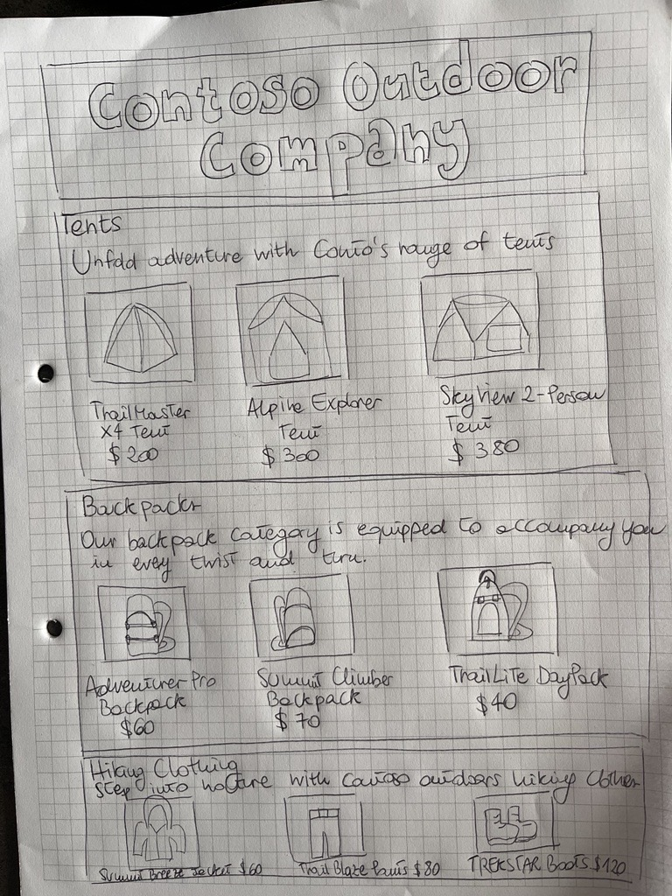
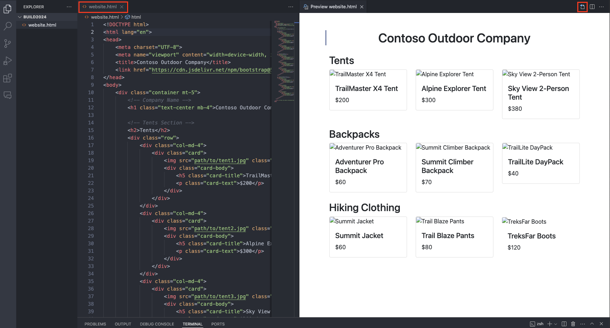

# Part 3 - Multimodal interfaces

By now we have interacted with LLMs using a single modality: inputting text and receiving either text or images. However, multimodal interfaces are becoming increasingly popular, as they allow users to interact with models using multiple modalities, such as text, images, and speech, thus facilitating human-computer interactions. In this section, we will explore how to use multimodal interfaces to interact with GPT-4 Turbo with Vision.


> [!TIP]
> **GPT-4 Turbo with Vision** is a multimodal model that incorporates both natural language processing and visual understanding. It is able to process as input a combination of text and images, and generate an output which is relevant to both modalities.

## Interacting with the model using an Image

From the chat interface, click on the attachment icon to upload a local image and then select the *contoso_outdoor_ecommerce_sketch_notes.jpg* image from the local Desktop folder.
Folder Path: Documents\Workshop-Interact-with-LLMs\Workshop instructions\Images\contoso_outdoor_ecommerce_sketch_notes.jpg


If you cannot find the image on the local Desktop of your VM, you can download it from [here](./Images/contoso_outdoor_ecommerce_sketch_notes.jpg).

.

This image represents a sketch of our Contoso Outdoor e-commerce website we want to build. We will use this image as input to GPT-4 Turbo with Vision to gather information from the image, and later generate a code snippet for the website, using the sketch as a reference.

Once you have uploaded the file, try these prompts start interacting with the image:

```How many products are shown in the homepage below?```


```What is the name of the company?```


```What is the most expensive product?```

## Generate a code snippet for the website UI from an image

Next, we will prompt the model to generate a code snippet for the website using the sketch as reference. Add the text below to instruct the model on how to use the image input:

```
Generate the html and bootstrap code to implement the UI of the Contoso Outdoor Company e-commerce landing page, based on the hand-drawn sketches in the image.
```

The outcome should provide a basic layout for the landing page of Contoso Outdoor Company. It includes placeholders for product descriptions, which you can populate with the text and image artifacts created throughout part 1 and 2.

If you want to view the code syntax is correct and what the template looks like:
1. Open VS Code on the VM
2. File - New file - type website.html (save it to the desktop of the VM)
3. Paste the HTML code generated into the empty html file
5. Select the 'Open preview' button on the top right of VS Code to view the output

.

Feel free to use the remaining time to adjust the code template according to the final design you wish to achieve.

## Apply Prompt Tuning

If you are not satisfied with the result you got in the previous step, you can apply some prompt tuning techniques to improve the quality of the generated code. In fact, the prompt you have used to instruct the model in the previous step already contains some prompt engineering best practices, such as *placing the image before the text* and specifying the *output format*. However, you can try to further refine the prompt to get better results.

> [!NOTE]
> If the model indicates an inability to perform the task, you can **handle the refusal** by requesting explanations for generated responses and what kind of information it misses to compete the task.

>[!alert] In the System message field insert the text below, then click "Apply changes".

```
## Task
You are a web designer for the Contoso Outdoor Company e-commerce website. Your goal is to generate the website code snippets for the homepage GUI.
```

In addition, let's modify the previous query, by breaking down the instructions into smaller steps. This will help the model to better understand the task and generate more accurate results. Clear the chat history and send the following text to the chat interface:

```
You will generate the website GUI template for the homepage of the e-commerce website.
Instructions:
1. Use the provided image to extract the layout, the sections, and the e-commerce products names and prices
2. Use html and bootstrap as output format
3. Add placeholders for products images
```

Congratulations! You have now completed the 3rd and last part of the lab and you learnt how to interact with multimodal models. Click next to wrap up the lab.
